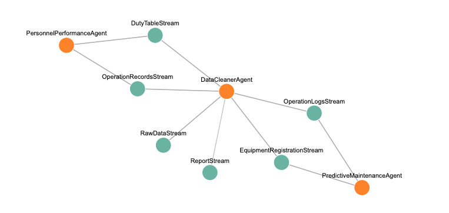
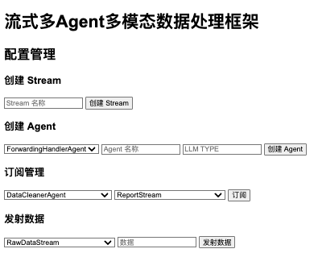

## 流式多Agent多模态数据处理框架
### Quick Start
1. 下载代码，进入主目录
2. 安装 streamllm

直接安装： `pip install .`

开发模式 `pip install -e .`

3. 启动Webserver:

`cd src/webserver`

`python backend.py`

### Framework
#### Stream 类
Stream 类负责管理一个数据流，是对多模态实时数据流的抽象
- 接受多模态数据：每个 Stream 可以接收不同类型的数据（如文本、图像、音频等），并将其分发给相应的 Agent
- 添加处理器（Handlers）：并允许注册多个处理器（Handlers）来处理进入的数据，这是通过被Agent订阅时添加其处理函数实现的
- Stream之间的数据传递：通过在Stream类中添加连接其他流的功能，实现数据从一个流传输到另一个流。

####  StreamManager 类
StreamManager 负责管理所有的 Stream 实例，包括创建、查找和删除 Stream。它确保不同的 Stream 能够被有效地组织和访问。

#### Agent 类
Agent 可以订阅同一个或不同的 Stream，并独立处理各自感兴趣的数据。这种设计允许不同的 Agent 专注于不同的任务，实现协同工作。

#### Agent Store 类
引入AgentStore类，用于集中管理所有Agent，使其具有可插拔性，方便动态添加或移除Agent。

#### DSL配置
使用 YAML 作为DSL的表示方式，因为它易于阅读和编写。DSL的主要部分包括：
- Streams：定义每个 Stream 的名称、以及连接的其他流。
- Agents：定义每个 Agent 的名称、 Agent自定义参数、订阅流以及输出流

用户可以用DSL来设计数据流图，大大简化的代码量和使用难度

用户也可以在WEB UI上进行操作，添加Stream和Agent，实时渲染Graph。
Web操作和配置文件是双向同步的，对Web的操作都是持久化到配置文件中



```yaml
streams:
- name: RawDataStream
- name: EquipmentRegistrationStream
- name: OperationLogsStream
- name: DutyTableStream
- name: OperationRecordsStream
- name: CleanDataStream
- name: TrendAnalysisStream
- name: EstimationStream
- name: ReportStream
agents:
- name: DataCleanerAgent
  category: AssistAgent
  llm_type: qwen
  subscribed_streams:
  - OperationRecordsStream
  - EquipmentRegistrationStream
  - RawDataStream
  - OperationLogsStream
  - DutyTableStream
  - ReportStream
- name: TrendAnalyzerAgent
  category: TextHandlerAgent
  subscribed_streams:
  - CleanDataStream
- name: EstimatorAgent
  category: TextHandlerAgent
  subscribed_streams:
  - TrendAnalysisStream
- name: ReportGeneratorAgent
  category: TextHandlerAgent
  subscribed_streams:
  - EstimationStream
- name: PredictiveMaintenanceAgent
  category: TextHandlerAgent
  subscribed_streams:
  - OperationLogsStream
  - EquipmentRegistrationStream
- name: PersonnelPerformanceAgent
  category: TextHandlerAgent
  subscribed_streams:
  - DutyTableStream
  - OperationRecordsStream
```

#### 数据流可视化界面
实时展示数据在Streams之间的流动及其被Agents处理的过程。

数据流过是节点（Stream/Agent）和连接都会有高亮的动画效果。



### Todo
功能点：
- Agent的 output_streams 增加
- Stream to Stream
效果点： 
- 状态显示：展示每个Agent的处理状态，如处理中、完成、错误等。
- 换成有向线段，Stream-Agent 有向实线，Stream-Stream 有向虚线
- 可拖拽的组件的增删改